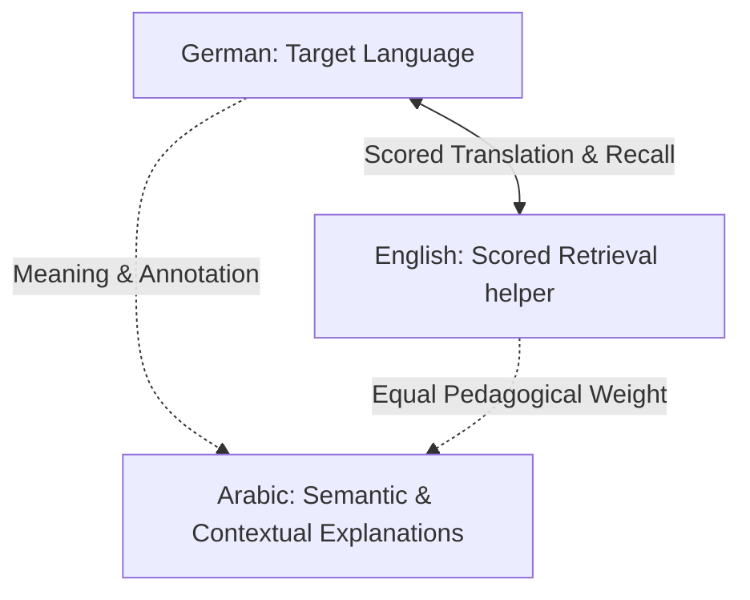

# Target Learning Model (TARGET_LEARNING_MODEL.md)

This document defines the educational architecture and pedagogical design of the upgraded **DeutschFlow** German Learning System.

---

## 1. Pedagogical Roles of Languages

To support adult learners of German, the system defines specific roles for the target, primary helper, and contextual helper languages.



### 1.1 German (Target Language)
German is the single active target language. The system trains lexical recall, syntax, inflection, and grammar rules. All active outputs typed or selected by the user (spelling, inflections, word ordering) evaluate the user's proficiency in German.

### 1.2 English (Scored helper)
English acts as the active semantic anchor. Because English and German share linguistic roots (e.g., strong verbs, cognates, structure), German-English and English-German retrieval is **fully scored**.
*   In English-prompt sessions, users type the exact German word/phrase.
*   In German-prompt sessions, users type the exact English equivalent.
*   Synonyms are mapped and resolved using an `acceptedEnglishAnswers` schema.

### 1.3 Arabic (Contextual helper)
Arabic holds equal pedagogical weight to English but serves as a **non-scoring semantic reference**.
*   Arabic meanings, grammatical annotations, and explanations are displayed alongside prompts to clarify nuances.
*   Users may type Arabic translations to self-test, but the system **must NOT grade Arabic inputs for score**. This prevents user frustration over spelling variations, dialect differences, or synonyms in Arabic script.

---

## 2. Curriculum & Progression Architecture

### 2.1 CEFR Level Progression
The curriculum is organized into Common European Framework of Reference for Languages (CEFR) levels:
*   **A1 (Beginner):** Focus on basic vocabulary, nominative/accusative articles, present tense verbs, and simple sentence structures.
*   **A2 (Elementary):** Focus on dative case, prepositions, separable verbs, past tense (Perfekt), and complex clauses.
*   **B1 (Intermediate) and beyond:** Subordinate clauses, passive voice, subjunctive mood (Konjunktiv II), and abstract vocabulary.

### 2.2 Course and Lesson Structure
Within each CEFR level, content is broken down into **Units** and **Lessons** matching standard course materials (e.g., Netzwerk Neu textbooks):
```
CEFR Level (e.g., A2)
 └── Unit (e.g., Unit 1: Wege im Beruf)
      ├── Lesson 1: Vocabulary & Phrases
      ├── Lesson 2: Grammar Focus (e.g., Separable Verbs)
      └── Lesson 3: Dialogue Practice (Sentences & Listening)
```
Lessons must be unlocked sequentially. Unlocking requires meeting a mastery threshold (e.g., scoring >80% accuracy) on preceding lesson review quizzes.

---

## 3. Learning Subsystems

### 3.1 Vocabulary Subsystem
Vocabulary is divided into distinct part-of-speech schemas with grammatical metadata requirements:
*   **Nouns:** Must include gender article (`der`/`die`/`das`) and plural form (e.g., `der Tisch, -e`). Studies require spelling the article and plural suffix.
*   **Verbs:** Must include principal forms (Präsens, Präteritum, Perfekt e.g., `sehen, sieht, sah, hat gesehen`) and separable prefix rules.
*   **Adjectives/Adverbs:** Must include comparative/superlative inflections where applicable.

### 3.2 Grammar Subsystem (Model-Driven)
Grammar is taught using interactive templates rather than static text files. Topics are represented as structured data models containing rules and parameters:
*   **Case Declension Engine:** Dynamic tables where users select or type ending inflections based on case (Nominative, Accusative, Dative, Genitive) and gender (masculine, feminine, neuter, plural).
*   **Conjugation Templates:** Verb matrix training (ich, du, er/sie/es, wir, ihr, sie/Sie) across active tenses.

### 3.3 Sentences & Context
*   **Syntax Ordering:** Sentence training requires arranging scrambled tokens (German words) into correct grammatical order (e.g., verb-second rule for main clauses, verb-last rule for subordinate clauses).
*   **Contextual Senses:** Words that have multiple meanings are grouped into distinct "senses" with specific example sentences, preventing translation confusion.

### 3.4 Listening (Audio-Driven)
*   **Acoustic Prompts:** Dictation exercises where users listen to a native speaker audio file and type what they hear in German.
*   **Audio Helpers:** Pronunciation audio is played during word introductions and after grading inputs. Audio must be cached locally for offline use.

### 3.5 Reading & Writing
*   **Reading Comprehension:** Short dialogues or paragraphs followed by comprehension checks (cloze tests, matching).
*   **Writing Prompts:** Guided writing exercises where users write short sentences matching a situation, with automated keyword validation.

---

## 4. Spaced Repetition (SRS) & Mastery Math

### 4.1 SRS Integration
The system generates a distinct **Card** for each skill linked to a curriculum item. Currently supported skills:
*   `recall_german`: Prompt is English -> user types German (participates in scoring).
*   `recall_english`: Prompt is German -> user types English (participates in scoring).
*   `article`: Noun gender typing (participates in scoring).
*   `syntax`: Scrambled sentence construction.

Intervals are managed dynamically by the SRS engine using user ratings (Again, Hard, Good, Easy) following a custom scheduler or standard FSRS (Free Spaced Repetition Scheduler) rules.

### 4.2 Mastery Calculations
Mastery is calculated at two levels:
1.  **Card Mastery:** A score from 0 to 100 based on consecutive correct streaks, repetition counts, and interval stability.
2.  **Word Mastery:** A weighted average of all active cards associated with that word (e.g., `recall_german` = 50%, `recall_english` = 30%, `article` = 20%).

---

## 5. Error Learning (Adaptive Remediation)
*   **Wrong Items Handling:** Incorrectly answered cards enter a high-frequency **Retry Queue** within the current session.
*   **Session Retention:** An item is not completed until it is answered correctly twice in a row, separated by a randomized spacing gap of other cards (retry limit and gap size managed in settings).
*   **Lapse Management:** Cards with high lapse counts (frequent failures) are flagged as "difficult cards." The system isolates these cards and presents them with simplified hints or matching exercises to rebuild retention.
