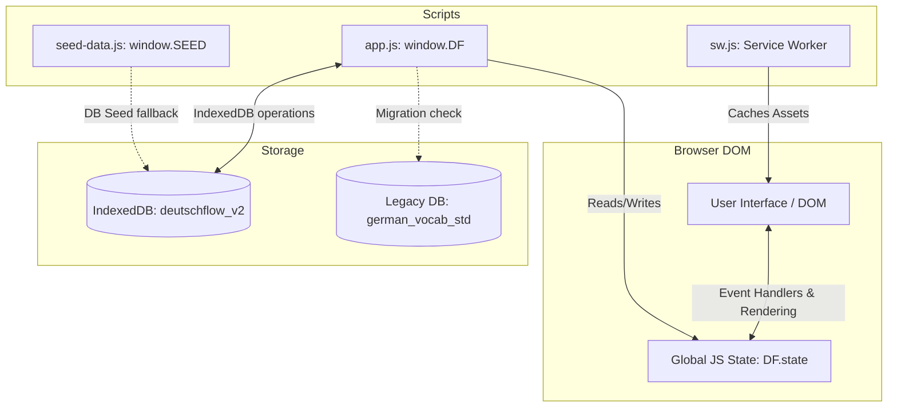

# Current Application Architecture (CURRENT_ARCHITECTURE.md)

This document provides a technical audit of the architectural structure, data flow, and runtime environment of the **DeutschFlow** baseline application.

---

## 1. High-Level System Architecture

DeutschFlow is a serverless, client-side **Progressive Web Application (PWA)** built on a vanilla web stack (HTML5, CSS3, JavaScript ES2022). It operates fully offline after the first visit.



---

## 2. Directory Structure and Roles
*   `index.html`: The monolithic SPA shell, entry point, and viewport config.
*   `styles.css`: CSS stylesheet containing custom theme variables and utility classes.
*   `sw.js`: Service worker implementing cache strategies for offline execution.
*   `manifest.webmanifest`: PWA metadata, defining start URL, colors, icons, and display mode.
*   `src/register-sw.js`: Registers `sw.js` under secure (HTTPS) environments.
*   `src/app.js`: Monolithic application logic (normalization, scheduling, database, UI rendering).
*   `data/seed-data.js`: In-memory static dictionary containing 2,820 learning items.

---

## 3. JavaScript Module Breakdown
`src/app.js` is structured as a monolithic file containing two Immediately Invoked Function Expressions (IIFEs) that share state via the global `window.DF` namespace.

### First IIFE: Core Logic & Mathematics
*   **Normalization Subsystem:** `normalizeGerman`, `normalizeArabic`, and `foldGerman` sanitize input string spaces, case, diacritics, and umlauts.
*   **Linguistic Parsing:** `splitArticle` extracts gender articles (`der`, `die`, `das`) from noun inputs; `inferItemType` classifies strings into `noun`, `word`, `phrase`, or `sentence`.
*   **Verification Math:** `levenshtein` calculates distance for typo toleration; `arabicTokenScore` performs keyword overlap scoring.
*   **Grading Engine:** `validateGermanAnswer`, `validateArticleAnswer`, and `validateArabicAnswer` evaluate user answers against expected dictionary definitions and accepted alternatives.
*   **Quality Audit Engine:** `qualityIssues` runs automated rule checks (unbalanced parentheses, exercise references, missing articles, etc.) to flag data issues.
*   **SRS Engine:** `createCard` instantiates cards; `scheduleCard` executes ease and interval adjustments; `cardMastery` maps card stats to a 0–100 progress scale.

### Second IIFE: Storage, State, and UI Controller
*   **IndexedDB Wrapper (`DF.DB`):** Asynchronous IndexedDB client wrapping transaction lifecycle, bulk operations, and metadata properties.
*   **Learning Coordinator (`DF.Learning`):** Coordinates session queues, interleaving, retry gaps, and session resumption states.
*   **Import/Export Subsystem:** Custom client-side ZIP decompressor (`unzip` utilizing `DecompressionStream`) and sheet mapper to parse `.xlsx` and `.csv` files.
*   **UI Views & Actions (`DF.UI`):** Dynamic DOM rendering engine utilizing ES template literals to render pages (`words`, `stats`, `settings`, `study`, `home`), toasts, and modals. Captures UI interactions via global event delegation.

---

## 4. State Management
All application state is held in a single global in-memory object, `DF.state`, initialized at boot:
```javascript
state = {
  route: "home",          // Active page: home, words, study, stats, settings
  settings: {},           // Copy of default settings + IndexedDB settings
  profile: {},            // Streak, totalXP, study date
  words: [],              // Cached array of all vocabulary items
  cards: [],              // Cached array of all review cards
  wordsMap: new Map(),    // O(1) word lookup by ID
  cardsMap: new Map(),    // O(1) card lookup by format key: "${wordId}:${skill}"
  session: null,          // Active session metadata (queue, stats)
  recentAttempts: [],     // Loaded recent attempt logs
  wordView: { query: "", filter: "all", limit: 200 }, // View filters
  orderState: null,       // Transient state for sentence order cards
  busy: false             // Block screen overlay flag
};
```
Whenever state changes, the UI is fully re-rendered dynamically by calling `DF.UI.render(state)`.

---

## 5. Storage Flow and Offline Capability
1.  **First Launch:** Opens IndexedDB. If `words` store is empty, it attempts to read the legacy `german_vocab_std` database.
2.  **Migration Fallback:**
    *   If legacy DB is found, converts data utilizing `transformLegacyWord` and `legacyCards` and populates the new store.
    *   If no legacy DB is found, reads `window.SEED` from `data/seed-data.js` and bulk-inserts them as the default database.
3.  **Caching Strategy:** `sw.js` caches `index.html`, `styles.css`, `src/app.js`, and `data/seed-data.js` on install. It intercepts all fetch requests using a Cache-First cache strategy to bypass network calls completely.

---

## 6. Runtime Assumptions & Dependencies
*   **Dependencies:** ZERO third-party libraries. All components (including ZIP/Excel parsing and IndexedDB wrapping) are hand-coded vanilla JS.
*   **Required APIs:**
    *   `indexedDB` (data persistence)
    *   `crypto.getRandomValues` (secure random generation for card shuffling)
    *   `DecompressionStream` (xlsx decompression)
    *   `DOMParser` (xml parsing inside xlsx sheets)
    *   `Intl.DateTimeFormat` (Arabic locale date formatting)
*   **Language Settings:** The shell specifies `dir="rtl"` and `lang="ar"`, assuming Arabic-oriented RTL layout formatting by default.
