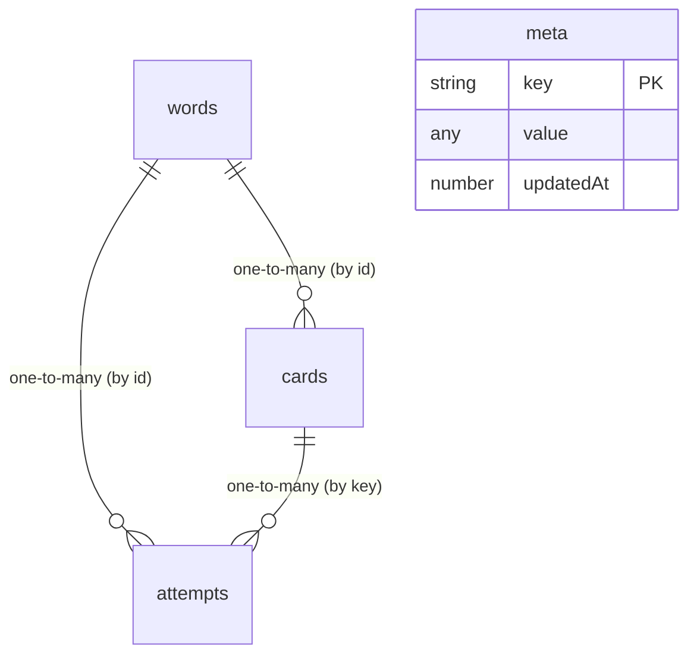

# Current Data Model (CURRENT_DATA_MODEL.md)

This document describes the schema of the `deutschflow_v2` IndexedDB database as implemented in `01_APPLICATION/CURRENT_APP/src/app.js`.

## Entity Relationship Overview

The database contains four object stores: `words`, `cards`, `attempts`, and `meta`. 

---

## 1. Object Store: `words`
Stores the German curriculum entries (words, nouns, phrases, sentences) and their metadata.

*   **Key Path:** `id` (integer)
*   **Indexes:**
    *   `normalizedGerman` (non-unique)
    *   `qualityStatus` (non-unique)

### Schema Fields
| Field Name | Type | Description |
|---|---|---|
| `id` | Number | **Primary Key.** Internal unique identifier. |
| `german` | String | The German text of the entry (including case and special characters). |
| `arabic` | String | The primary Arabic meaning/translation. |
| `pronunciation` | String | Arabic-script phonetic representation of the German word. |
| `normalizedGerman` | String | Lowercased German string with punctuation removed for quick matching. |
| `normalizedArabic` | String | Arabic string stripped of diacritics (harakat), alif/ya/ta-marbuta spelling variations, and punctuation. |
| `itemType` | String | Inferred type: `noun`, `word`, `phrase`, or `sentence`. |
| `article` | String | Noun gender article: `der`, `die`, `das` (or `null` if not a noun). |
| `plural` | String | Plural form of the word (mostly empty in current seeds). |
| `level` | String | CEFR level (A1, A2, etc., from seed data or import). |
| `tags` | Array of Strings | Categories associated with the word. |
| `acceptedAnswers` | Array of Strings | Alternative German spellings or synonyms accepted during grading. |
| `acceptedArabicAnswers` | Array of Strings | Alternative Arabic translations accepted during grading. |
| `sourceRow` | Number | Corresponding row in the raw Excel seed dataset. |
| `favorite` | Boolean | Starred status indicator. |
| `ignored` | Boolean | True if quarantined/hidden from session learning queues. |
| `userFlagged` | Boolean | True if flagged by the user due to suspected linguistic or layout error. |
| `createdAt` | Number | Unix epoch timestamp of creation. |
| `updatedAt` | Number | Unix epoch timestamp of last update. |
| `qualityStatus` | String | Quality state: `"ok"` or `"review"`. |
| `qualityIssues` | Array of Strings | Specific validation violations flagged by the automated rules. |
| `qualityNote` | String | Curator or automated rationale for flags/patches. |

---

## 2. Object Store: `cards`
Represents the Spaced Repetition System (SRS) cards generated for specific skills on top of vocabulary words.

*   **Key Path:** `key` (string, format: `${wordId}:${skill}`)
*   **Indexes:**
    *   `wordId` (non-unique)
    *   `dueAt` (non-unique)
    *   `skill` (non-unique)

### Schema Fields
| Field Name | Type | Description |
|---|---|---|
| `key` | String | **Primary Key.** Format: `${wordId}:${skill}`. |
| `wordId` | Number | **Foreign Key.** Refers to `words.id`. |
| `skill` | String | Skill type: `"recall"`, `"recognition"`, `"article"`, or `"order"`. |
| `state` | String | Card SRS state: `"new"`, `"learning"`, `"review"`, or `"mastered"`. |
| `dueAt` | Number | Unix epoch timestamp of when the card is next due for review. |
| `intervalDays` | Number | Current SRS interval in days. |
| `ease` | Number | Easement factor (starting at `2.5`, constrained to `[1.3, 3.2]`). |
| `stability` | Number | Stability metric (used in custom scheduler calculation). |
| `difficulty` | Number | Difficulty weight (defaults to `5`). |
| `reps` | Number | Total repetition attempts during review sessions. |
| `lapses` | Number | Number of times the card was failed/forgotten (Again rating). |
| `correct` | Number | Total correct answers. |
| `wrong` | Number | Total incorrect answers. |
| `streak` | Number | Current consecutive correct answer streak. |
| `mastery` | Number | Card mastery score (0 to 100). |
| `lastReviewedAt` | Number | Unix epoch timestamp of last review session. |
| `lastResult` | Number | Last SRS rating score: `1` (Again), `2` (Hard), `3` (Good), or `4` (Easy). |
| `suspended` | Boolean | True if the card is excluded from active schedules due to structural change. |
| `createdAt` | Number | Unix epoch timestamp of card creation. |
| `updatedAt` | Number | Unix epoch timestamp of last update. |

---

## 3. Object Store: `attempts`
Log of every review attempt submitted by the user.

*   **Key Path:** `id` (integer, autoIncrement)
*   **Indexes:**
    *   `createdAt` (non-unique)
    *   `wordId` (non-unique)
    *   `cardKey` (non-unique)
    *   `sessionId` (non-unique)
    *   `skill` (non-unique)
    *   `correct` (non-unique)
    *   `answerType` (non-unique)

### Schema Fields
| Field Name | Type | Description |
|---|---|---|
| `id` | Number | **Primary Key.** Auto-incrementing integer. |
| `wordId` | Number | **Foreign Key.** Refers to `words.id`. |
| `cardKey` | String | **Foreign Key.** Refers to `cards.key`. |
| `sessionId` | String | Unique ID identifying the specific study session. |
| `skill` | String | Skill evaluated: `"recall"`, `"recognition"`, `"article"`, or `"order"`. |
| `correct` | Boolean | True if user answer was graded as correct. |
| `answerType` | String | Detailed grading result type (e.g. `"perfect"`, `"minor_typo"`, `"article_missing"`, etc.). |
| `userAnswer` | String | What the user actually typed. |
| `correctAnswer` | String | Expected answer. |
| `elapsedMs` | Number | Response latency in milliseconds. |
| `usedHint` | Boolean | True if the user requested a hint. |
| `revealed` | Boolean | True if the user skipped the item and revealed the correct answer. |
| `createdAt` | Number | Unix epoch timestamp of the attempt. |

---

## 4. Object Store: `meta`
Simple key-value configuration store for settings, user profile, and session states.

*   **Key Path:** `key` (string)

### Supported Keys & Values
| Key | Value Type | Description |
|---|---|---|
| `"settings"` | Object | JSON settings payload matching `DEFAULT_SETTINGS` structure in `app.js`. |
| `"profile"` | Object | Streak status (`streak`), study date (`lastStudyDate`), and accumulated experience points (`totalXP`). |
| `"session"` | Object | Serialization of the active, incomplete study session queue and statistics. |
| `"lastSessionWordOrder"` | Array | Array of word IDs from the previous session to avoid duplicate starting patterns. |
| `"engineVersion"` | Number | Version tracking for potential migration patches. |
